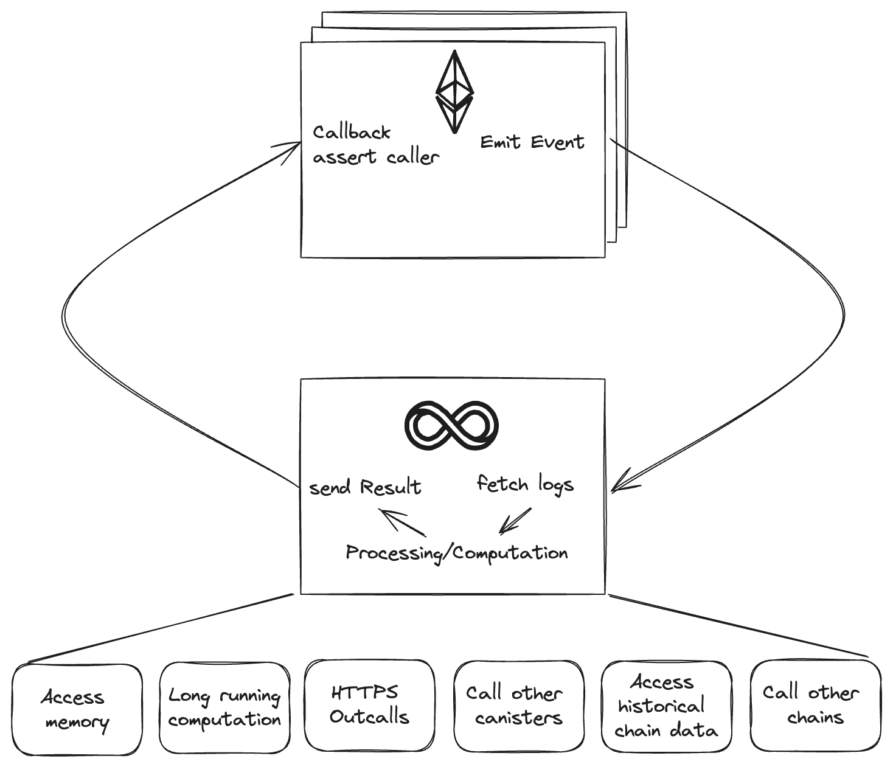
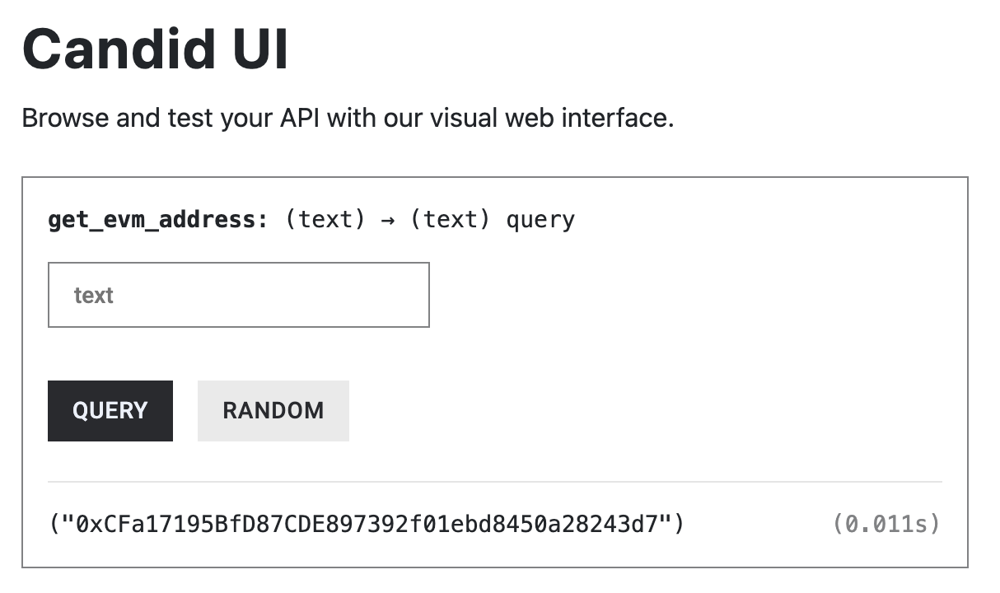

# ICP ETH Coprocessor


## Overview

This project demonstrates how to use the Internet Computer as a coprocessor for Ethereum smart contracts. The coprocessor listens to events emitted by an Ethereum smart contract, processes them, and sends the results back.

This is an early project and should be considered as a proof of concept. It is not production-ready and should not be used in production environments. There are quite some TODOs in the code which will be addressed over time. If you have any questions or suggestions, feel free to open an issue or reach out to me on the [DFINITY Developer Forum](https://forum.dfinity.org/u/domwoe/summary) or [X](https://twitter.com/domiwoe).

## What is a coprocessor?

The concept of coprocessors originated in computer architecture as a technique to enhance performance. Traditional computers rely on a single central processing unit (CPU) to handle all computations. However, the CPU became overloaded as workloads grew more complex.

Coprocessors were introduced to offload specific tasks from the CPU to specialized hardware. We see the same happening in the EVM ecosystem. EVM smart contracts, and Ethereum in particular, are a very constrained computing environment. Coprocessors and stateful Layer 2 solutions enable to extend the capabilities of the EVM by offloading specific tasks to more powerful environments.

You can read more about coprocessors in the context of Ethereum in the article ["A Brief Into to Coprocessors"](https://crypto.mirror.xyz/BFqUfBNVZrqYau3Vz9WJ-BACw5FT3W30iUX3mPlKxtA). The first paragraph of this section was directly taken from this article.

## Why use ICP as a coprocessor for Ethereum?

Canister smart contracts on ICP can securely read from EVM smart contracts (using HTTPS Outcalls or the EVM RPC canister) and write to them (using Chain-key Signatures, i.e. Threshold ECDSA). Hence, there are no additional parties needed to relay messages between the two networks, and no additional work needs to be done on the EVM side to verify the results of the computation as the EVM smart contract just needs to check for the proper sender.

Furthermore, canister smart contracts have many capabilities and properties that can be leveraged to extend the reach of smart contracts:

- WASM Runtime, which is much more efficient than the EVM, and allows programming in Rust, JavaScript, and other traditional languages (next to [Motoko](https://internetcomputer.org/docs/current/motoko/main/motoko/)).
- 404 GiB of memory,
- Long-running computations that even allow [running AI inference](https://x.com/dominic_w/status/1770884845570326589).
- HTTPS Outcalls allow canisters to interact with other chains and traditional web services.
- Chain signatures allow canisters to sign transactions for other chains.
- Timers allow syncing with EVM events and scheduling other tasks.
- Unbiasable randomness provided by the threshold BLS signatures straight from the heart of [ICP's Chain-key technology](https://internetcomputer.org/how-it-works/chain-key-technology/).


For more context on how ICP can extend Ethereum, check out [this presentation](https://docs.google.com/presentation/d/1P9wycxRsJ6DM_c8TbZG4Xun5URYZbk3WALS4UpSH0iA/edit?usp=sharing) from EthereumZuri 2024


## Architecture



### EVM Smart contract

The contract `Coprocessor.sol` emits an event `NewJob` when the `newJob` function is called. The `newJob` function sends all funds to the account controlled by the `icp_eth_coprocessor` canister and emits the event.

The contract also has a `callback` function that can only be called by the `icp_eth_coprocessor` canister. This function is called by the `icp_eth_coprocessor` canister to send the results of the processing back to the contract.

The source code of the contract can be found in `contracts/Coprocessor.sol`.

### ICP ETH Coprocessor canister

The `icp_eth_coprocessor` canister listens to events emitted by the Ethereum smart contract by periodically calling the `eth_getLogs` RPC method via the [EVM RPC canister](https://github.com/internet-computer-protocol/evm-rpc-canister). When an event is received, the canister can do all kinds of synchronous and asynchronous processing. When the processing is done, the canister sends the results back by creating a transaction calling the `callback` function of the contract. The transaction is signed using threshold signatures and sent to the Ethereum network via the EVM RPC canister.

## Tutorial

### Step 0: Prerequisites

- [x] Install [IC SDK (dfx)](https://internetcomputer.org/docs/current/developer-docs/getting-started/install/#installing-dfx).
- [x] Install [Node.js](https://nodejs.org/en/download).
- [x] Install the Rust toolchain including target `wasm32-unknown-unknown`
- [x] Install [MetaMask](https://metamask.io/) wallet browser extension (or any other Ethereum wallet that supports the Seplia ETH testnet and export of private keys). 


### Step 1: Clone the repository and setup the project

```bash
git clone https://github.com/domwoe/icp-eth-coprocessor
cd icp-eth-coprocessor
npm install
```

### Step 2: Start the local Internet Computer replica

It is recommended to start the replica in a dedicated terminal window. This will allow you to see the logs when the canister is running later on.

```bash
dfx start --clean
```

Alternatively, the replica can be started in the background by adding the `--background` flag.

### Step 3: Deploy the canisters to the local replica

```bash
dfx deploy
```

This will deploy the EVM RPC canister and the coprocessor canister to the local replica. The EVM RPC canister requires the size of the subnet it gets deployed to as an initialization argument. You'll be prompted to enter the subnet size in the terminal.

```bash
Installing code for canister evm_rpc, with canister ID 7hfb6-caaaa-aaaar-qadga-cai
This canister requires an initialization argument.
Enter a value for InitArgs : record { nodesInSubnet : nat32 }
Enter field nodesInSubnet : nat32
  ? Enter a nat32 › 
```

Since the mainnet instance of the EVM RPC canister is deployed to a subnet with 28 nodes, it is best to use the same subnet size here. Enter `28` and press `Enter`.

```bash

If all goes well, a similar output will be displayed:

```bash
Deployed canisters.
URLs:
  Backend canister via Candid interface:
    evm_rpc: http://127.0.0.1:4943/?canisterId=bd3sg-teaaa-aaaaa-qaaba-cai&id=7hfb6-caaaa-aaaar-qadga-cai
    icp_eth_coprocessor: http://127.0.0.1:4943/?canisterId=bd3sg-teaaa-aaaaa-qaaba-cai&id=bkyz2-fmaaa-aaaaa-qaaaq-cai
```
Opening the URLs in a browser allows interaction with the canisters via Candid UI.

### Step 4: Get the Ethereum/EVM address controlled by the canister

```bash
dfx canister call icp_eth_coprocessor get_evm_address
```
This will return the Ethereum address controlled by the canister, i.e. something like:

```bash
("0xCFa17195BfD87CDE897392f01ebd8450a28243d7")
```

Alternatively, the address can be retrieved via the Candid UI of the `icp_eth_coprocessor` canister.



### Step 5: Prepare the Ethereum/EVM smart contract

This project uses [Hardhat](https://hardhat.org/) including [Hardhat Ignition](https://hardhat.org/ignition/docs/getting-started#overview) to deploy the Ethereum Smart Contract. 

The Ignition script to deploy the contract is located in `ignition/modules/coprocessor.js`. 

Open the file and replace the EVM address with the one obtained in the previous step.

```javascript
const { buildModule } = require("@nomicfoundation/hardhat-ignition/modules");

const CoprocessorModule = buildModule("CoprocessorModule", (m) => {
  const coprocessor = m.contract("Coprocessor", ["0xCFa17195BfD87CDE897392f01ebd8450a28243d7"]); // replace EVM address

  return { coprocessor };
});

module.exports = CoprocessorModule;
```

This will make sure that only the `icp_eth_coprocessor` canister can call the `callback` function of the contract.

### Step 6: Create a new Ethereum account to deploy the contract

- Create a new account in MetaMask and switch to the SepoliaETH testnet.
- Open the account details of this new account and click on `Show private Key`.
- Follow the steps and copy the private key to the clipboard.
  
Set the private key to be used by Hardhat by running:

```bash
npx hardhat vars set SEPOLIA_PRIVATE_KEY
```

and paste the private key when prompted.

### Step 7: Fund your Ethereum/EVM developer account with some SepoliaETH

There are several faucets with different eligibility criteria. Check [FaucetLink](https://faucetlink.to/sepolia) and fund your Ethereum/EVM developer account with some SepoliaETH.

### Step 8: Get an Infura API key

Get an Infura API key from [Infura](https://infura.io/) for Sepolia ETH testnet and set it as a Hardhat environment variable:

```bash
npx hardhat vars set INFURA_API_KEY
```

### Step 9: Deploy the contract

Run the following command to deploy the contract to the Sepolia ETH testnet:

```bash
npx hardhat ignition deploy ignition/modules/coprocessor.js --network sepolia
```

This should return the following output:

```bash
Compiled 1 Solidity file successfully (evm target: paris).
Hardhat Ignition 🚀

Deploying [ CoprocessorModule ]

Batch #1
  Executed CoprocessorModule#Coprocessor

[ CoprocessorModule ] successfully deployed 🚀

Deployed Addresses

CoprocessorModule#Coprocessor - 0xFe15805f952c6A1a465aDdD993457Ec640Ee57aA
```

`0xFe15805f952c6A1a465aDdD993457Ec640Ee57aA` in the last line is the address of the deployed contract.

### Step 10: Set the contract address in the `icp_eth_coprocessor` canister

Run the following command:

```bash
dfx canister call icp_eth_coprocessor set_contract
```
and provide the contract address when prompted.

Alternatively, the contract address can be set via the Candid UI of the `icp_eth_coprocessor` canister.

Now, the `icp_eth_coprocessor` canister should try fetching logs of the contract every minute. This should be visible in the terminal where the replica is running.

### Step 11: Trigger an event

Open `scripts/runJob.js` and replace the contract address with the one obtained in step 9.
Then run the script:

```bash
npx hardhat run scripts/runJob.js --network sepolia
```

This will send a transaction calling the `newJob` function of the contract. This function emits an event that the `icp_eth_coprocessor` canister listens to. The function also sends all funds to the account controlled by the `icp_eth_coprocessor` canister, such the canister can pay for the gas to call the `callback`.

```solidity
function newJob() public payable {
        job_id++;
        uint256 amount = address(this).balance;
        (bool success, ) = coprocessor.call{value: amount}("");
        require(success, "Failed to send Ether");
        emit NewJob(job_id);
    }
```

### Step 12: Check the logs and Etherscan

The logs of the `icp_eth_coprocessor` canister should show that an event was received and an Ethereum transaction was sent.
Check also the Etherscan page of the contract, it should show two transactions: the one you sent and the one sent by the `icp_eth_coprocessor` canister.
Here is an example: [Etherscan](https://sepolia.etherscan.io/address/0xfe15805f952c6a1a465addd993457ec640ee57aa)

### Step 13: Experiment with custom processing logic

The processing logic can be found in `src/icp_eth_coprocessor/src/lib.rs`. 

```rust
async fn process_job(job_id: u64) {
    ic_cdk::print(format!("Processing job {}", job_id));
    //TODO: Implement the actual job processing logic
    let result = "42";
    submit_result(job_id, result).await;
}
```

Go ahead and implement your custom processing logic.


